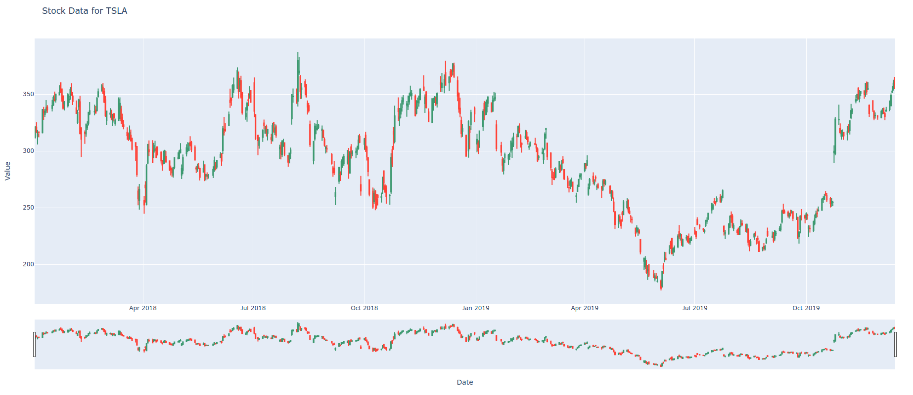

# Stonks

Data parsing, analysis and vizualization using Yahoo Finance data.

### Execution
There are 3 pieces of information required for execution that can be provided through command line arguments:

1. The name of the stock, denoted by the 3-4 letter abbreviation. *(Ex. ABRV)*
2. The starting date for the timeline. *(Format yyyy-mm-dd)*
3. The ending date for the timeline. *Format yyyy-mm-dd)*

**Example:**
> python stonks.py 'AMD' '2018-01-01' '2019-12-31'

If command line arguments are not provided, the program will prompt the user for input.

### Example Screenshot

# Dependencies

[Pandas Data Reader](https://pypi.org/project/pandas/)

[Plotly Graphing Tool](https://pypi.org/project/plotly/)

[Yahoo Finance API](https://github.com/ranaroussi/yfinance)

[FX Json Vizualizer](https://github.com/antonmedv/fx)
